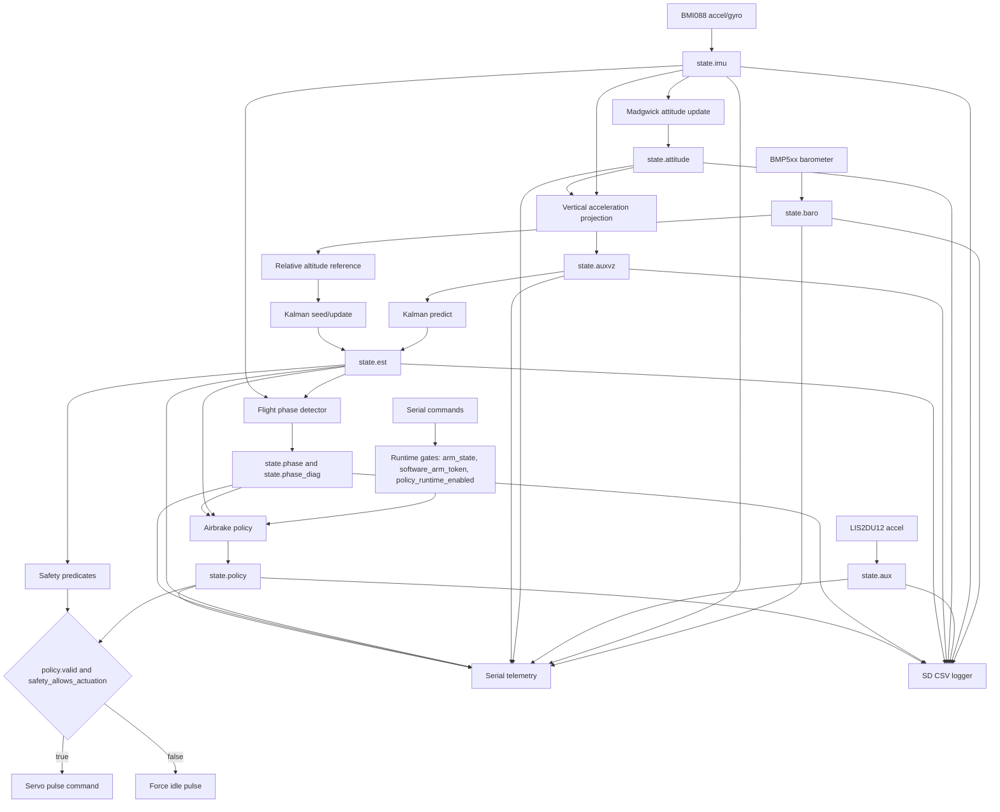

# Caelum Sufflamen

Real-time Teensy 4.1 firmware for deterministic vertical-state estimation, flight-phase classification, and safety-gated apogee-targeting airbrake control.

## Abstract

Caelum Sufflamen is an embedded flight-control firmware project for a rocket airbrake module. The project addresses the problem of converting noisy barometric and inertial measurements into a defensible, observable, and safety-gated actuator command for apogee management. The firmware runs a fixed-order Arduino/Teensy scheduler, publishes validity-qualified sensor and estimator snapshots, estimates altitude and vertical velocity with a Madgwick attitude solution plus a two-state Kalman filter, classifies flight phase with latched dwell logic, and computes normalized airbrake deployment intent from a quadratic-drag apogee model.

The technical contribution of the repository is a reviewable control and evidence pipeline rather than a monolithic sketch: sensing, estimation, phase classification, policy intent, safety gating, actuation, telemetry, and SD logging have explicit ownership boundaries. Host-side tests exercise the policy, phase detector, command parser, previous-year data audit, analytical coast simulation, and aerodynamic fitting utilities. The current aerodynamic constants remain placeholders because the committed previous-year CSV data lacks the command/deployment and coast-through-apogee evidence required to identify vehicle-specific airbrake coefficients.

## Overview

### Purpose

This repository exists to support development of a model-based rocket airbrake controller on Teensy 4.1 hardware. It is intended to be understandable by reviewers, maintainable by future contributors, and testable before flight hardware is trusted.


### Scope

The repository currently covers:

| In scope                                                 | Not yet in scope                                                           |
| -------------------------------------------------------- | -------------------------------------------------------------------------- |
| Teensy 4.1 Arduino firmware architecture                 | Certified or flight-qualified controller claims.                           |
| BMP5xx, BMI088, and LIS2DU12 data acquisition            | Full multi-sensor redundancy or voting.                                    |
| Quaternion attitude and vertical acceleration projection | Complete 6-DOF vehicle dynamics simulation.                                |
| Two-state altitude and vertical-speed estimation         | GPS/GNSS or magnetometer fusion in the active runtime.                     |
| Conservative phase detection and apogee-targeting policy | Vehicle-specific aerodynamic identification from current airbrake flights. |
| Serial commands, telemetry, SD logging, and host tests   | Firmware-in-the-loop or hardware-in-the-loop infrastructure.               |

### Key Features

- Deterministic 50 Hz main scheduler with non-blocking command service and bounded runtime work.
- Shared `SystemState` snapshot model with `valid`, `updated`, timestamp, and sequence semantics.
- BMP5xx barometer, BMI088 accelerometer/gyroscope, and LIS2DU12 auxiliary accelerometer acquisition.
- Madgwick quaternion attitude update and world-vertical acceleration projection.
- Two-state Kalman filter for altitude and vertical velocity using measured IMU `dt`.
- Stateful `IDLE`, `BOOST`, `COAST`, `BRAKE`, and `DESCENT` phase detector with latches and dwell timers.
- Explicit `ARM` and `POLICY` runtime command path before policy intent can become non-idle.
- Model-based apogee prediction and fixed-count bisection command solve.
- Pulse-width servo writes through `writeMicroseconds`.
- Shared warning-mask generation for Serial telemetry and SD logs.
- Host-side Python tests and validation utilities.


Open gaps include vehicle-specific aerodynamic coefficients, complete simulation, firmware-in-the-loop testing, hardware-in-the-loop testing, and committed target-board oscilloscope or logic-analyzer evidence for servo pulse widths.

## Architecture

### High-Level Data and Control Flow



### Major Subsystems

| Subsystem                   | Primary files                                                                                | Responsibility                                                                                                                             |
| --------------------------- | -------------------------------------------------------------------------------------------- | ------------------------------------------------------------------------------------------------------------------------------------------ |
| Scheduler and orchestration | `CaelumSufflamen.ino`                                                                        | Owns boot order, main-loop timing, subsystem call order, telemetry cadence, SD service timing, and final actuation decision.               |
| Shared data contracts       | `include/data_types.h`, `utils/config.h`, `utils/math_utils.h`                               | Defines runtime state, snapshot semantics, constants, helper math, parsing, and unit conventions.                                          |
| Sensor acquisition          | `include/sensors.h`, `src/sensors.cpp`                                                       | Initializes hardware and publishes one bounded barometer, IMU, and auxiliary accelerometer snapshot per scheduler pass.                    |
| Attitude estimation         | `include/attitude.h`, `src/attitude.cpp`                                                     | Maintains private quaternion state, publishes attitude, and computes vertical acceleration from body-frame acceleration.                   |
| Altitude estimation         | `include/estimation.h`, `include/kalman_alt2.h`, `src/estimation.cpp`, `src/kalman_alt2.cpp` | Selects relative altitude reference, runs Kalman predict/update, and publishes altitude, velocity, acceleration, and covariance.           |
| Phase classification        | `include/flight_phase.h`, `src/flight_phase.cpp`                                             | Classifies `IDLE`, `BOOST`, `COAST`, `BRAKE`, and `DESCENT` with latches, dwell timers, and diagnostic fields.                             |
| Airbrake policy             | `include/airbrake_policy.h`, `src/airbrake_policy.cpp`                                       | Computes normalized deployment intent from a drag-aware apogee model under explicit arming, phase, freshness, and altitude/speed gates.    |
| Safety and actuator output  | `include/safety.h`, `src/safety.cpp`, `include/actuator.h`, `src/actuator.cpp`               | Applies final actuation permission and maps normalized command to servo pulse width, or forces idle.                                       |
| Commands                    | `utils/commands.h`, `utils/commands.cpp`                                                     | Implements bounded Serial command parsing, arming, policy enable, baseline commands, and `SIM_APOGEE`.                                     |
| Telemetry and logging       | `utils/telemetry.h`, `utils/telemetry.cpp`, `utils/sd_logger.h`, `utils/sd_logger.cpp`       | Emits fixed-schema Serial CSV telemetry, diagnostics, status, warning masks, and SD CSV logs.                                              |
| Host validation             | `tests/host/*.py`                                                                            | Provides source-integrated reference-model tests, policy simulation, replay validation, coefficient fitting, and previous-year data audit. |

### External Interfaces

| Interface         | Direction                             | Current contract                                                                                                    |
| ----------------- | ------------------------------------- | ------------------------------------------------------------------------------------------------------------------- |
| USB Serial        | Host to firmware and firmware to host | `115200` baud command, status, telemetry, and diagnostic channel.                                                   |
| I2C               | Firmware to sensors                   | BMP5xx, BMI088, and LIS2DU12 sensor access through Arduino `Wire`.                                                  |
| Built-in SD card  | Firmware to storage                   | Creates `LOG###.CSV`, writes a fixed header, appends runtime rows, flushes by row and time cadence.                 |
| Servo output      | Firmware to actuator                  | `PIN_AIRBRAKE_SERVO = 9`, normalized command mapped to configured pulse width and written with `writeMicroseconds`. |
| Host Python tools | Developer to repository               | Validation scripts read firmware constants from `utils/config.h` and CSV data from committed log locations.         |

### Runtime Control Path

The policy is compiled in by default in the current branch, but a non-idle policy command still requires explicit runtime gates:

```text
arm_state == ARMED
software_arm_token == true
policy_runtime_enabled == true
phase in {COAST, BRAKE}
estimator valid and fresh
altitude >= POLICY_MIN_ALT_M
vertical speed >= POLICY_MIN_VZ_MPS
predicted overshoot beyond deadband
```

The command path is exposed through Serial:

```text
ARM ARMED
POLICY 1
```

`ARM DISARMED`, `ARM SAFE`, or `POLICY 0` resets policy output and forces the actuator idle. `ARM ARMED` is accepted only while the phase is `IDLE`, which prevents arming from being introduced after a flight phase has already been detected.

## Repository Structure

| Path                                                      | Role                                                                                                                 |
| --------------------------------------------------------- | -------------------------------------------------------------------------------------------------------------------- |
| `CaelumSufflamen.ino`                                     | Arduino sketch entry point, boot sequence, deterministic scheduler, and top-level actuation decision.                |
| `include/`                                                | Public subsystem interfaces and shared `SystemState` data contracts.                                                 |
| `src/`                                                    | Core subsystem implementations for sensing, attitude, estimation, phase, policy, safety, and actuation.              |
| `utils/`                                                  | Configuration, command parser, telemetry, SD logger, and math/string helpers staged into the Arduino sketch build.   |
| `tools/teensy41_arduino_cli.ps1`                          | Canonical PowerShell wrapper that stages the split source tree and invokes `arduino-cli`.                            |
| `tests/host/`                                             | Host-side Python test harness, policy simulation, replay validator, empirical fitter, and previous-year data audit.  |
| `validation/`                                             | Documentation and artifacts for replay validation and aerodynamic coefficient identification.                        |
| `validation/results/previous_year_flight_data_audit.json` | Machine-readable audit of the committed previous-year CSV data.                                                      |
| `flight data/`                                            | Previous-year CSV logs: six drop logs, one stationary log, and thirty legacy MC logs.                                |
| `simulation/README.md`                                    | Current simulation and planned firmware-in-the-loop/hardware-in-the-loop roadmap.                                    |
| `BUILDING.md`                                             | Board, FQBN, dependencies, canonical build command, upload command, and limitations.                                 |
| `Airbrake_Policy_Documentation.md`                        | Narrative expected behavior for phase/policy integration.                                                            |
| `Repository_Study_Notes.md`                               | Historical engineering study notes; useful context, but partly superseded by current build and validation artifacts. |
| `.gitignore`                                              | Ignores `.build/`, macOS resource-fork files, Python bytecode, and `__pycache__/`.                                   |

## Theory of Operation

### 1. Boot

At startup, `CaelumSufflamen.ino` initializes conservative software defaults, configures the heartbeat LED, starts Serial, initializes sensors, optionally captures a barometric pressure baseline, resets the estimator, initializes the SD logger, attaches the actuator, forces idle, prints command help, prints the telemetry header, and finally announces `BOOT,READY`.

The boot sequence intentionally captures the barometer baseline before runtime estimation begins. This keeps the estimator, telemetry, and SD logs in the same altitude reference frame.

### 2. Scheduler Timing

The main scheduler runs at:

```text
LOOP_HZ = 50
LOOP_PERIOD_US = 1000000 / LOOP_HZ
```

The loop advances `next_loop_us` by a fixed period after each due pass. This preserves average cadence without blocking. Heartbeat and command parsing run on every Arduino `loop()` entry, even when the main 50 Hz pass is not yet due.

### 3. Sensor Snapshot Publication

Each runtime sensor poll attempts at most one acquisition per call:

| Snapshot     | Source   | Units                                                                     |
| ------------ | -------- | ------------------------------------------------------------------------- |
| `state.baro` | BMP5xx   | temperature in deg C, pressure in hPa, altitude in m.                     |
| `state.imu`  | BMI088   | acceleration in m/s^2, angular rate in rad/s, acceleration norm in m/s^2. |
| `state.aux`  | LIS2DU12 | auxiliary acceleration in m/s^2 and acceleration norm.                    |

Snapshots carry metadata:

| Field             | Semantics                                                                                                                   |
| ----------------- | --------------------------------------------------------------------------------------------------------------------------- |
| `valid`           | Payload is semantically usable by downstream consumers.                                                                     |
| `updated`         | Owning module produced a fresh publication during its most recent service call; this is observability, not a consume latch. |
| `t_ms` and `t_us` | Publication or acquisition timestamps used for freshness and measured `dt`.                                                 |
| `seq`             | Successful-publication counter.                                                                                             |

Consumers are expected to gate on metadata and finiteness before using payload values.

### 4. Attitude and Vertical Acceleration

The attitude module owns a private quaternion. A valid IMU update:

1. Rejects invalid `dt` and non-finite sensor values.
2. Normalizes the accelerometer vector.
3. Applies Madgwick gradient correction to gyro integration.
4. Renormalizes the quaternion.
5. Publishes `state.attitude`.

The estimator then projects body-frame acceleration into the world vertical axis using the quaternion and removes gravity according to the firmware sign convention:

```text
a_vertical = world_z_component(body_acceleration, q) + g
```

This derived acceleration is published in `state.auxvz`.

### 5. Altitude and Velocity Estimation

The Kalman state is:

```text
x = [h, v]^T
```

where `h` is relative altitude in meters and `v` is vertical velocity in meters per second, positive upward.

Prediction uses measured IMU sample interval:

```text
h(k+1) = h(k) + v(k) * dt + 0.5 * a * dt^2
v(k+1) = v(k) + a * dt
```

Barometric altitude supplies the scalar measurement:

```text
z = h + noise
```

The covariance prediction uses acceleration process noise from `kSigmaA2`, and correction uses `kR`. The update uses Joseph-form covariance correction and explicitly symmetrizes the off-diagonal covariance terms.

### 6. Flight-Phase Classification

The phase detector consumes estimator altitude, estimator vertical speed, and IMU acceleration norm. It uses private latches and dwell timers so isolated noisy samples do not immediately change the phase state.

| Phase     | Meaning                                                                 |
| --------- | ----------------------------------------------------------------------- |
| `IDLE`    | No confirmed launch. This is the fail-safe preflight state.             |
| `BOOST`   | Launch has been confirmed and burnout has not yet been confirmed.       |
| `COAST`   | Burnout has been confirmed and the vehicle is still in upward coast.    |
| `BRAKE`   | Previous-cycle policy output indicates active braking intent.           |
| `DESCENT` | Sustained non-positive vertical velocity indicates post-apogee descent. |

`BRAKE` depends on previous-cycle policy intent because `flight_phase_update()` runs before `airbrake_policy_compute()` in the scheduler. That introduces a deterministic one-cycle supervisory latency.

### 7. Apogee Policy

The airbrake policy models upward coast with quadratic drag:

```text
dv/dt = -g - k(u) * v^2
k(u) = rho * (CDA_body + u * CDA_brake) / (2 * m)
```

For locally constant density and drag area, the predicted apogee is:

```text
h_apogee(u) = h + ln(1 + k(u) * v^2 / g) / (2 * k(u))
```

For very small `k`, the policy falls back to the ballistic limit:

```text
h_apogee = h + v^2 / (2 * g)
```

The command solver predicts apogee at zero deployment, predicts apogee at maximum deployment, then uses fixed-count bisection to select a normalized deployment command. It applies a slew-rate limit before publishing policy intent.

### 8. Safety and Actuation

Policy output is intent only. Hardware movement still requires `safety_allows_actuation(state)` and `state.policy.valid`.

The safety predicate checks:

| Gate                              | Purpose                                                  |
| --------------------------------- | -------------------------------------------------------- |
| `ACTUATION_ENABLED`               | Compile-time hard gate.                                  |
| `state.cfg.valid`                 | Prevents acting with invalid runtime configuration.      |
| `state.est.valid`                 | Prevents acting without a fused vertical-state estimate. |
| Estimator age <= `EST_MAX_AGE_MS` | Prevents stale estimates from driving hardware.          |

If any gate fails, the scheduler calls `actuator_force_idle()`. The actuator maps normalized command to pulse width using:

```text
servo_us = servo_us_min + command01 * (servo_us_max - servo_us_min)
```

The current implementation writes pulse-equivalent microseconds directly and stores the last requested pulse for telemetry.

### 9. Observability

Serial telemetry and SD logging are engineering evidence channels. They include validity flags, update flags, sequence counters, timestamps, sensor values, attitude, vertical acceleration, estimator state, covariance, phase diagnostics, arming gates, policy outputs, actuator pulse width, configuration references, and warning masks.

The SD logger runs last in the scheduler so each row records the state already used for policy and actuation in that same cycle.

## Design and Implementation

### Shared-State Contract

`SystemState` is the central integration object. It is intentionally a plain aggregate rather than a hidden framework. Each module owns a small portion of it and publishes snapshots into that portion.

The `updated` field is consistently treated as an external observability flag: it reports whether the owning module published fresh data in its most recent service call. It is not a cross-module consume flag that downstream modules clear.

### Configuration and Constants

`utils/config.h` centralizes:

- feature switches,
- scheduler rates,
- command buffer size,
- barometer calibration settings,
- SD logging cadence,
- warning-mask allocation,
- physical constants,
- Madgwick and Kalman tuning,
- servo pin and pulse bounds,
- policy target and aerodynamic constants,
- phase-detection thresholds,
- uncertainty margin settings.

The current branch defaults both `ACTUATION_ENABLED` and `AIRBRAKE_POLICY_ENABLED` to `1`, which permits the complete control path to be exercised in development builds. Runtime arming, policy enable, phase, estimator freshness, and safety gates still prevent non-idle hardware output unless conditions are explicitly satisfied.

### Command Parser

The Serial command parser is bounded by `CMD_BUF_N = 96`. It consumes only already-buffered Serial bytes and dispatches complete CR/LF-terminated lines. If a line exceeds the buffer, the parser emits `ERR,CMD_TOO_LONG` and discards all bytes until the next newline. This prevents a suffix of an overlong command from being accidentally executed as a later command.

Supported commands:

| Command                    | Effect                                                                                                        |
| -------------------------- | ------------------------------------------------------------------------------------------------------------- |
| `HELP`                     | Print command list.                                                                                           |
| `STATUS`                   | Print compact status and policy/phase state.                                                                  |
| `HDR 0` or `HDR 1`         | Disable or enable periodic telemetry rows.                                                                    |
| `ARM DISARMED` or `ARM 0`  | Clear arm token, disable policy runtime gate, reset policy, force idle.                                       |
| `ARM SAFE` or `ARM 1`      | Enter safe state, clear arm token, disable policy runtime gate, reset policy, force idle.                     |
| `ARM ARMED` or `ARM 2`     | Enter armed state only if phase is `IDLE`, set software arm token, reset policy.                              |
| `POLICY 0` or `POLICY OFF` | Disable runtime policy gate, reset policy, force idle.                                                        |
| `POLICY 1` or `POLICY ON`  | Enable runtime policy gate.                                                                                   |
| `SET_SLP <hpa>`            | Set sea-level pressure reference and reset estimator/log reference state.                                     |
| `CAP_BASELINE`             | Capture current valid barometer pressure as baseline and reset estimator/log reference state.                 |
| `CAL_BASELINE`             | Run bounded averaged baseline calibration and reset estimator/log reference state.                            |
| `SIM_APOGEE <h_m> <v_mps>` | Print no-brake, full-brake, and solved-command apogee predictions when `AIRBRAKE_POLICY_TEST_API` is enabled. |

`CAL_BASELINE` is intentionally blocking but bounded. It is a ground or boot operation, not a flight-loop operation.

### Warning Mask

`telemetry_warn_mask(state)` is the single warning-mask generator for both Serial and SD outputs. Current allocation:

| Bit | Meaning                                       |
| --- | --------------------------------------------- |
| 0   | BMP5xx hardware not initialized.              |
| 1   | BMI088 accelerometer not initialized.         |
| 2   | BMI088 gyroscope not initialized.             |
| 3   | LIS2DU12 not initialized.                     |
| 4   | Barometer snapshot invalid.                   |
| 5   | IMU snapshot invalid.                         |
| 6   | Auxiliary accelerometer snapshot invalid.     |
| 7   | Derived vertical acceleration invalid.        |
| 8   | Attitude snapshot invalid.                    |
| 9   | Estimator snapshot invalid.                   |
| 10  | Runtime configuration invalid.                |
| 13  | SD unavailable or runtime SD failure latched. |

Bits 11 and 12 are reserved by comment for compatibility with larger Caelum branches.

### Data and Validation Scripts

The host scripts are intentionally source-coupled: they parse constants from `utils/config.h` instead of duplicating all configuration by hand.

| Script                                          | Purpose                                                                                          |
| ----------------------------------------------- | ------------------------------------------------------------------------------------------------ |
| `tests/host/run_host_tests.py`                  | Runs the host-side regression harness.                                                           |
| `tests/host/policy_coast_sim.py`                | Runs a minimal 1D coast simulation using the policy drag model and command shaping.              |
| `tests/host/policy_aero_empirical_fit.py`       | Fits body and brake drag-area coefficients from compatible SD logs.                              |
| `tests/host/replay_policy_validation.py`        | Replays compatible SD logs through the configured apogee predictor and reports prediction error. |
| `tests/host/audit_previous_year_flight_data.py` | Audits previous-year CSV schemas for coefficient-identification suitability.                     |

## Build and Usage

### Prerequisites

| Requirement      | Current repository contract                                                                    |
| ---------------- | ---------------------------------------------------------------------------------------------- |
| Board            | Teensy 4.1.                                                                                    |
| Build tool       | `arduino-cli`.                                                                                 |
| FQBN             | `teensy:avr:teensy41`.                                                                         |
| Platform package | A Teensy Arduino package that provides the Teensy 4.1 FQBN.                                    |
| Core libraries   | Arduino core, `Wire`, `SD`, and Teensy-compatible servo backend.                               |
| Sensor libraries | Headers matching `Adafruit_BMP5xx.h`, `Adafruit_Sensor.h`, `BMI088.h`, and `LIS2DU12Sensor.h`. |
| Host validation  | Python 3 with only standard-library modules for the committed host tests.                      |

### Canonical Build Command

From the repository root:

```powershell
powershell -ExecutionPolicy Bypass -File .\tools\teensy41_arduino_cli.ps1 -ArduinoCli arduino-cli
```

The wrapper:

1. Resolves the project root.
2. Creates `.build/teensy41/staged_sketch/`.
3. Copies `CaelumSufflamen.ino` into the staged sketch root.
4. Copies headers from `include/` and `utils/` into the staged sketch root.
5. Copies `.c`, `.cc`, and `.cpp` files from `src/` and `utils/` into `staged_sketch/src/`.
6. Invokes `arduino-cli compile --fqbn teensy:avr:teensy41 --warnings all`.

### Canonical Upload Command

Replace `COM7` with the port reported by `arduino-cli board list`:

```powershell
powershell -ExecutionPolicy Bypass -File .\tools\teensy41_arduino_cli.ps1 -ArduinoCli arduino-cli -Upload -Port COM7
```

Build artifacts are written under:

```text
.build/teensy41/staged_sketch/
.build/teensy41/output/
```

### Execution Workflow

1. Install the Teensy board package and required sensor libraries in the Arduino CLI environment.
2. Connect the Teensy 4.1 over USB.
3. Build with the canonical wrapper.
4. Upload with the canonical wrapper and the correct port.
5. Open a Serial monitor at `115200` baud.
6. Confirm boot messages including `BOOT,BEGIN` and `BOOT,READY`.
7. Confirm sensor health from boot lines and `STATUS`.
8. Capture or calibrate the barometer baseline while the vehicle is stationary.
9. Keep the system disarmed during bench setup.
10. Use `ARM ARMED` and `POLICY 1` only in a controlled, restrained, and reviewed test state.

### Simulation and Deployment Workflow

Current committed simulation and replay support is analytical and host-side, not a complete vehicle or hardware simulation.

Example policy coast simulation:

```powershell
python .\tests\host\policy_coast_sim.py --mode policy --h0-m 120 --v0-mps 90 --target-apogee-m 300
```

Example previous-year data audit:

```powershell
python .\tests\host\audit_previous_year_flight_data.py --data-dir "flight data" --json-out .\validation\results\previous_year_flight_data_audit.json
```

Example empirical fit for future compatible SD logs:

```powershell
python .\tests\host\policy_aero_empirical_fit.py .\validation\data\flight_001\LOG000.CSV --json-out .\validation\results\flight_001_policy_fit.json
```

Example replay validation for future compatible SD logs:

```powershell
python .\tests\host\replay_policy_validation.py .\validation\data\flight_001\LOG000.CSV --json-out .\validation\results\flight_001_policy_replay.json
```

The planned progression is:

| Level                           | Status    | Description                                                                                           |
| ------------------------------- | --------- | ----------------------------------------------------------------------------------------------------- |
| Serial model probe              | Committed | `SIM_APOGEE` exposes policy math on target.                                                           |
| Analytical host simulation      | Committed | `policy_coast_sim.py` evaluates the drag model and command shaping.                                   |
| Replay validation               | Committed | `replay_policy_validation.py` evaluates compatible SD logs against configured constants.              |
| Firmware-in-the-loop            | Planned   | Host build with deterministic Arduino, sensor, SD, Serial, and time shims.                            |
| Teensy 4.1 hardware-in-the-loop | Planned   | Real board timing, scripted sensor replay, Serial capture, SD capture, and servo pulse-width capture. |

## Configuration

### Compile-Time Feature Switches

| Symbol                     | Current default | Meaning                                                                     |
| -------------------------- | --------------- | --------------------------------------------------------------------------- |
| `BMI088_ENABLED`           | `1`             | Enable BMI088 accelerometer and gyroscope acquisition.                      |
| `BMI088_USE_SPI`           | `0`             | Present but not used by current I2C implementation.                         |
| `LIS2DU12_ENABLED`         | `1`             | Enable LIS2DU12 auxiliary accelerometer acquisition.                        |
| `LIS2MDL_ENABLED`          | `0`             | Placeholder for magnetometer support; not active in current runtime.        |
| `ACTUATION_ENABLED`        | `1`             | Compile actuator command path. Runtime gates still control non-idle output. |
| `AIRBRAKE_POLICY_ENABLED`  | `1`             | Compile policy command generation. Runtime gates still control validity.    |
| `AIRBRAKE_POLICY_TEST_API` | `1`             | Expose test/prediction API and `SIM_APOGEE` command.                        |

### Timing and Telemetry Constants

| Constant                 | Value    | Meaning                                    |
| ------------------------ | -------- | ------------------------------------------ |
| `SERIAL_BAUD`            | `115200` | USB Serial command and telemetry rate.     |
| `BOOT_SERIAL_TIMEOUT_MS` | `2000`   | Bounded boot wait for USB Serial.          |
| `LOOP_HZ`                | `50`     | Main scheduler rate.                       |
| `HEARTBEAT_MS`           | `250`    | Status LED toggle period.                  |
| `DIAG_PERIOD_MS`         | `1000`   | Diagnostic line cadence.                   |
| `TLM_PERIOD_MS`          | `100`    | Serial telemetry row cadence when enabled. |
| `CMD_BUF_N`              | `96`     | Serial command buffer capacity.            |
| `SD_LOG_HZ`              | `50`     | SD row cadence.                            |
| `SD_FLUSH_EVERY_LINES`   | `50`     | Flush cadence by row count.                |
| `SD_FLUSH_EVERY_MS`      | `500`    | Flush cadence by elapsed time.             |

### Estimator and Physics Constants

| Constant           | Value      | Role                                            |
| ------------------ | ---------- | ----------------------------------------------- |
| `kG`               | `9.80665`  | Gravity constant in m/s^2.                      |
| `MADGWICK_BETA`    | `0.1`      | Attitude correction gain.                       |
| `EST_MIN_IMU_DT_S` | `0.0005`   | Lower measured-IMU-dt guard.                    |
| `EST_MAX_IMU_DT_S` | `0.1000`   | Upper measured-IMU-dt guard.                    |
| `kSigmaH2`         | `5.71e-03` | Barometric altitude measurement variance basis. |
| `kR`               | `kSigmaH2` | Kalman measurement variance.                    |
| `kSigmaA2`         | `2.73e-03` | Acceleration process-noise intensity.           |
| `EST_MAX_AGE_MS`   | `200`      | Safety freshness limit for estimator output.    |

### Airbrake Policy Constants

| Constant                          | Value    | Role                                                |
| --------------------------------- | -------- | --------------------------------------------------- |
| `POLICY_TARGET_APOGEE_M`          | `300.0`  | Nominal target apogee in estimator reference frame. |
| `POLICY_MIN_ALT_M`                | `30.0`   | Minimum altitude for policy activation.             |
| `POLICY_MIN_VZ_MPS`               | `15.0`   | Minimum upward velocity for policy activation.      |
| `POLICY_APOGEE_DEADBAND_M`        | `5.0`    | No-command overshoot deadband.                      |
| `POLICY_VEHICLE_MASS_KG`          | `2.50`   | Vehicle mass used by apogee model.                  |
| `POLICY_RHO_KGPM3`                | `1.225`  | Local density assumption used by apogee model.      |
| `POLICY_CDA_BODY_M2`              | `0.0040` | Placeholder body drag area.                         |
| `POLICY_CDA_BRAKE_M2`             | `0.0200` | Placeholder incremental brake drag area.            |
| `POLICY_MAX_COMMAND01`            | `1.0`    | Maximum normalized deployment command.              |
| `POLICY_SLEW_PER_SEC`             | `1.5`    | Normalized command slew limit.                      |
| `POLICY_MAX_EST_AGE_MS`           | `200`    | Policy-local estimator freshness gate.              |
| `POLICY_BISECTION_STEPS`          | `18`     | Fixed iteration count for command solve.            |
| `POLICY_SIGMA_MARGIN_N`           | `1.0`    | Altitude sigma count subtracted from target.        |
| `POLICY_MAX_UNCERTAINTY_MARGIN_M` | `20.0`   | Maximum covariance-derived target reduction.        |

### Placeholder Parameters and Provenance

The aerodynamic constants in `utils/config.h` are explicitly documented as placeholders:

```text
POLICY_VEHICLE_MASS_KG
POLICY_RHO_KGPM3
POLICY_CDA_BODY_M2
POLICY_CDA_BRAKE_M2
```

The committed previous-year data under `flight data/` was audited and was not sufficient to replace these constants. The audit result is committed at `validation/results/previous_year_flight_data_audit.json`.

Future replacement requires logs with:

- observed apogee or complete coast-through-descent altitude history,
- estimator altitude and vertical velocity during coast/brake intervals,
- airbrake command or actuator deployment state,
- vehicle mass and atmospheric-density assumptions for the fitted interval.

### Runtime-Modifiable Settings

| Setting                      | Command                                 | Notes                                                                          |
| ---------------------------- | --------------------------------------- | ------------------------------------------------------------------------------ |
| Serial telemetry rows        | `HDR 0` or `HDR 1`                      | Diagnostics and command responses remain available.                            |
| Sea-level pressure reference | `SET_SLP <hpa>`                         | Resets estimator and SD logger reference timing.                               |
| Barometer baseline           | `CAP_BASELINE` or `CAL_BASELINE`        | Establishes local altitude reference and resets estimator/log reference state. |
| Arming state                 | `ARM DISARMED`, `ARM SAFE`, `ARM ARMED` | `ARM ARMED` requires phase `IDLE`.                                             |
| Policy runtime gate          | `POLICY 0` or `POLICY 1`                | Non-idle policy intent requires this gate plus arming.                         |

## Verification and Testing

### Existing Verification Artifacts

| Artifact                                                  | Verification value                                                                                                                                            |
| --------------------------------------------------------- | ------------------------------------------------------------------------------------------------------------------------------------------------------------- |
| `tests/host/run_host_tests.py`                            | Regression harness for policy, phase, parser overflow handling, source integration, simulation, previous-year data audit, and analytic empirical-fit fixture. |
| `tests/host/policy_coast_sim.py`                          | Confirms increasing brake authority reduces apogee in the analytical model and that policy commands remain normalized.                                        |
| `tests/host/audit_previous_year_flight_data.py`           | Proves the committed previous-year data cannot justify aerodynamic coefficient replacement.                                                                   |
| `tests/host/policy_aero_empirical_fit.py`                 | Defines the future data contract for coefficient identification from compatible SD logs.                                                                      |
| `tests/host/replay_policy_validation.py`                  | Defines the future replay contract for model prediction error on compatible SD logs.                                                                          |
| `validation/results/previous_year_flight_data_audit.json` | Records the schema and suitability results for 37 committed CSV logs.                                                                                         |
| `Airbrake_Policy_Documentation.md`                        | States expected phase/policy behavior for rest, boost, coast below target, coast above target, and descent.                                                   |
| `BUILDING.md`                                             | Defines canonical board, FQBN, required libraries, build command, upload command, and build limitations.                                                      |

### Host Test Command

```powershell
python .\tests\host\run_host_tests.py
```

The current harness includes checks for:

- valid policy command generation in `COAST` when armed and policy-enabled,
- policy invalidation when disarmed,
- phase progression to `COAST` and `DESCENT`,
- command overflow discard-until-newline behavior,
- source integration invariants,
- analytical coast simulation response to brake authority,
- previous-year data audit blocking coefficient replacement,
- empirical aerodynamic fitting on an analytic fixture.

### What Is Verified

| Verified behavior                                                                                 | Method                                                                                    |
| ------------------------------------------------------------------------------------------------- | ----------------------------------------------------------------------------------------- |
| Policy can produce a nonzero valid command in `COAST` under the explicit arming and policy gates. | Host reference model in `run_host_tests.py`.                                              |
| Disarmed or un-tokened state prevents policy validity.                                            | Host reference model in `run_host_tests.py`.                                              |
| Phase detector reaches `COAST` and `DESCENT` under representative motion samples.                 | Host reference model in `run_host_tests.py`.                                              |
| Overlong command lines are fully discarded until newline.                                         | Host parser model in `run_host_tests.py` and source check in `utils/commands.cpp`.        |
| SD warning mask uses the same generator as Serial telemetry.                                      | Source integration check and `telemetry_warn_mask(state)` usage in `utils/sd_logger.cpp`. |
| Actuator writes pulse-equivalent microseconds.                                                    | Source integration check for `writeMicroseconds` in `src/actuator.cpp`.                   |
| Previous-year data cannot identify current body or brake coefficients.                            | Audit script and committed JSON result.                                                   |

### What Is Not Yet Verified

| Gap                                                                             | Consequence                                                                                                              |
| ------------------------------------------------------------------------------- | ------------------------------------------------------------------------------------------------------------------------ |
| No committed Teensy 4.1 build transcript from a pinned environment.             | Build workflow is canonical but not bit-for-bit reproducible.                                                            |
| No exact library versions are pinned.                                           | Different developer machines may resolve different sensor or Teensy library versions.                                    |
| No current-flight SD log with policy command and coast-through-apogee evidence. | Aerodynamic constants remain placeholders.                                                                               |
| No firmware-in-the-loop test binary.                                            | Host tests model selected behavior in Python rather than compiling firmware C++ against shims.                           |
| No hardware-in-the-loop rig.                                                    | Real scheduler timing, SD behavior, sensor injection, Serial scripts, and servo pulses are not yet repeatably exercised. |
| No committed oscilloscope or logic-analyzer evidence for servo pulses.          | Pulse-width mapping is implemented in code but still needs target-board measurement.                                     |
| No formal sensor-axis calibration artifact.                                     | The accelerometer sign convention and mounting orientation must be validated on the actual vehicle.                      |

### Validation Acceptance for Aerodynamic Updates

Before replacing the placeholder coefficients, a future change should include:

1. Compatible SD logs under `validation/data/<flight_id>/`.
2. Raw or minimally processed evidence sufficient to identify coast and brake intervals.
3. `policy_aero_empirical_fit.py` JSON output under `validation/results/`.
4. Replay validation output showing prediction bias and RMSE with both old and new constants.
5. A justified `utils/config.h` update.
6. A short note describing mass, air density assumption, airbrake configuration, launch conditions, and anomalies.

## Results

### Committed Data Audit

The repository contains 37 previous-year CSV logs under `flight data/`:

| Category                        | Count | Audit result                                                                                                                                  |
| ------------------------------- | ----- | --------------------------------------------------------------------------------------------------------------------------------------------- |
| Legacy MC logs                  | 30    | Include `t_us`, `kf_h`, and `kf_v`, but lack current SD policy columns and actuator command state.                                            |
| Raw sensor/drop/stationary logs | 7     | Include raw sensor-style fields, but lack phase, estimator velocity, policy command, and observed apogee fields required for current fitting. |

The committed audit reports:

```text
file_count = 37
legacy_mc_log_count = 30
raw_sensor_log_count = 7
body_identifiable_log_count = 0
brake_identifiable_log_count = 0
can_update_policy_cda_body_m2 = false
can_update_policy_cda_brake_m2 = false
```

Interpretation: these logs are useful for schema review and historical context, but they do not justify replacing `POLICY_CDA_BODY_M2` or `POLICY_CDA_BRAKE_M2`.

### Reproducible Repository Outputs

Current reproducible outputs are:

| Output                              | Command                                                                                                                                                |
| ----------------------------------- | ------------------------------------------------------------------------------------------------------------------------------------------------------ |
| Host regression result              | `python .\tests\host\run_host_tests.py`                                                                                                                |
| Previous-year data audit JSON       | `python .\tests\host\audit_previous_year_flight_data.py --data-dir "flight data" --json-out .\validation\results\previous_year_flight_data_audit.json` |
| Analytical coast simulation summary | `python .\tests\host\policy_coast_sim.py --mode policy --h0-m 120 --v0-mps 90 --target-apogee-m 300`                                                   |
| Teensy build artifacts              | `powershell -ExecutionPolicy Bypass -File .\tools\teensy41_arduino_cli.ps1 -ArduinoCli arduino-cli`                                                    |

### Demonstration Workflow

A review-safe demonstration can show:

1. Host tests passing.
2. The previous-year audit proving the coefficient limitation.
3. `SIM_APOGEE` on a connected board to expose the policy math without requiring flight state.
4. `STATUS` output showing sensor health, arming state, policy gate, phase, policy output, actuator pulse, and warning mask.
5. SD log creation on Teensy 4.1 with a stable CSV schema.
6. A restrained bench actuator check showing idle behavior when gates are not satisfied.

## Design Decisions and Tradeoffs

| Decision                                | Rationale                                                                                   | Tradeoff                                                                  |
| --------------------------------------- | ------------------------------------------------------------------------------------------- | ------------------------------------------------------------------------- |
| Single-threaded deterministic scheduler | Easier timing analysis and review than asynchronous callbacks.                              | Sensor and logging work must remain bounded.                              |
| Shared `SystemState` snapshots          | Makes data contracts explicit and observable.                                               | Requires discipline to preserve field ownership and update semantics.     |
| `updated` as observability flag         | Telemetry can distinguish fresh publications from stale state without hidden consume logic. | Consumers must not treat `updated` as an ownership-transfer latch.        |
| Policy computes intent only             | Keeps control law separated from hardware authority.                                        | Requires separate safety and actuator checks to remain synchronized.      |
| Runtime arming plus policy enable       | Prevents compile-time-enabled policy from acting without explicit operator path.            | Adds required operator workflow and more telemetry fields.                |
| Fixed-count bisection solver            | Deterministic runtime cost and easy review.                                                 | Uses a simple monotonic model; fidelity depends on aerodynamic constants. |
| Pulse-width servo writes                | Aligns telemetry and physical actuator unit with microseconds.                              | Requires target-board pulse-width validation.                             |
| SD logger records live estimator state  | Ensures logs match the state used for policy and safety.                                    | No independent logger-local estimator for cross-checking.                 |
| Host tests in Python                    | Fast to run without hardware or Arduino toolchain.                                          | Does not replace compiled C++ unit tests or target timing tests.          |
| Library versions unpinned               | Keeps setup simple while hardware dependencies evolve.                                      | Reduces reproducibility across machines.                                  |

## Limitations

- The aerodynamic constants in `utils/config.h` remain placeholders and should not be presented as identified vehicle coefficients.
- The committed previous-year data cannot identify the current airbrake policy coefficients because it lacks deployment command state and observed coast-through-apogee evidence.
- The analytical coast simulation is not a full simulation environment; it does not model sensor noise, actuator dynamics, full vehicle aerodynamics, rotation, launch rail effects, or atmospheric variation.
- The host tests are reference-model and source-integration checks; they are not a compiled firmware-in-the-loop suite.
- Sensor mounting, IMU axis sign convention, and barometric reference behavior still require vehicle-level validation.
- The firmware is not certified and should not be treated as flight-ready without independent review, ground tests, flight-readiness review, and range-safety approval.
